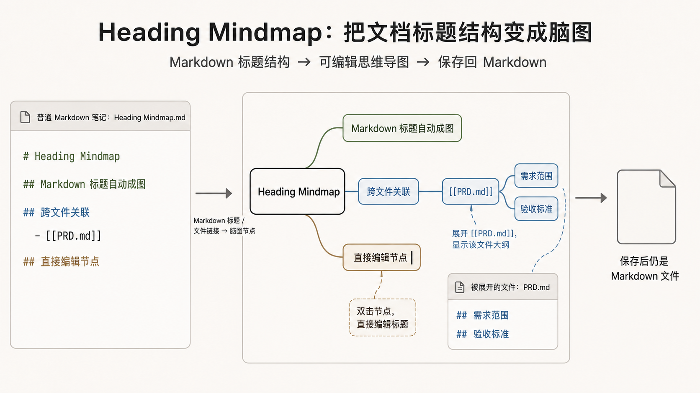

# Heading Mindmap

Heading Mindmap is an Obsidian plugin that opens Markdown heading structures as editable mind maps.

It keeps Markdown as the source of truth. The mind map shows the heading tree at the top, while the bottom pane lets you read or edit the selected section body. Title, body, and structure changes are written back to the original Markdown file.



## Features

- Open a Markdown note as a dedicated mind map view.
- Show the Markdown file as a document root while keeping every real heading, including multiple H1 headings, editable as heading nodes.
- Edit heading titles inline in the mind map.
- Edit the selected heading body in a bottom pane.
- Paste images into the bottom body editor and insert Obsidian attachment embeds.
- Minimize the bottom body pane to focus on editing the mind map.
- Render body content with Obsidian Markdown preview styling.
- Add, delete, promote, and reorder nodes with keyboard shortcuts.
- Add Markdown file nodes and expand target file headings as read-only outlines.
- Optionally show Markdown list items from the current body as read-only virtual child nodes.
- Preserve collapsed nodes, expanded file nodes, selection, scroll, and zoom state.

## Usage

Enable `Heading Mindmap` in Obsidian settings, then run the command `Open mind map` (`heading-mindmap:open`). In Chinese Obsidian languages, the same command is shown as `打开思维导图`.

The command opens the current Markdown file as a mind map. If the current tab is already a mind map for the same file, the existing view is reused; otherwise a new tab is opened so the normal Markdown source view can stay available.

Keyboard shortcuts:

- `Tab`: add child node.
- `Shift+Enter`: add sibling node, including another H1 when an H1 is selected.
- `Enter`: edit selected node title.
- `Ctrl+Enter`: focus the body editor.
- `Shift+Tab`: promote selected node.
- `Alt+Up` / `Alt+Down`: reorder sibling nodes.
- `Space`: collapse or expand the selected subtree.
- `Delete`: delete the selected node.
- Arrow keys: move selection.

## 中文说明

Heading Mindmap 是一个 Obsidian 思维导图插件，让 Markdown 笔记可以用“可编辑思维导图”方式打开。

导图是笔记内容的结构化视图。标题层级决定节点层级；上方导图只显示标题树，下方正文区域以阅读/编辑模式查看和编辑当前节点正文，结果写回原 Markdown 文件。

产品需求见 [docs/PRD.md](docs/PRD.md)。

## 核心能力

- 导图上方只显示标题树，节点内不放操作按钮或正文内容；长标题会按节点宽高自适应完整展示。
- 文件名作为文档根节点展示，真实 Markdown 标题作为其子节点；多个 H1 会作为同级一级标题保留和编辑。
- 正文在下方单栏面板中查看和编辑，阅读模式使用 Obsidian Markdown 渲染，右上角可切换到源码编辑模式；编辑模式支持直接粘贴图片并插入 Obsidian 附件嵌入链接，也可最小化正文区域以专注编辑导图。
- Markdown 文件节点标题显示文件名，双击后根据目标文件大纲展开子导图。
- 可选把正文里的 Markdown 列表项作为只读虚拟子节点展示到导图上，不改写原 Markdown。
- 思维导图本身保存为普通 Markdown 文件。
- 支持键盘交互：`Tab` 新建子节点，`Enter` 内联编辑标题，`Ctrl+Enter` 聚焦正文面板，方向键移动选中节点。

## 当前实现状态

已实现：

- 打开独立思维导图视图。
- 从 Markdown 文件解析导图结构。
- 新建子节点、新建兄弟节点、删除节点及子树、同级排序、节点升级；H1 可新建同级 H1。
- 从当前库选择 Markdown 文件并添加为文件节点。
- 双击文件节点展开/收起目标文件标题层级。
- 下方正文区域默认显示 Markdown 阅读效果，右上角按钮可切换到源码编辑视图，也可最小化为标题栏。
- 下方正文编辑区支持从剪贴板粘贴图片，图片按 Obsidian 附件规则保存并写入嵌入链接。
- 正文列表项可选展示为只读虚拟导图子节点。
- 节点标题内联编辑，正文在下方面板编辑。
- 导图节点按标题长度调整尺寸，长标题完整换行显示。
- PRD 定义的键盘操作。
- 第六级标题边界提示。
- 普通 Markdown 视图修改后，导图视图自动刷新。
- 子树折叠、文件展开状态记忆。
- 同一文件的多个导图视图分别保存选中节点、滚动和缩放状态。
- 基础缩放和平移。

待补齐：

- 更完整的撤销/重做集成。

## 开发命令

```powershell
npm install
npm run build
npm test
```

发布或修改 Obsidian 运行时交互前，额外运行真实 Obsidian 端到端验证：

```powershell
npm run build
npm run test:e2e:obsidian
```

该脚本需要 Node.js 22 或更高版本，并默认使用 `C:\Program Files\Obsidian\Obsidian.exe`；如安装路径不同，可通过 `OBSIDIAN_EXE` 环境变量指定。

开发监听：

```powershell
npm run dev
```

## 部署到 Obsidian 测试库

推荐使用脚本：

```powershell
npm run deploy -- "D:\path\to\your\test-vault"
```

也可以手动复制以下文件到库目录：

```text
.obsidian/plugins/heading-mindmap/
```

需要复制：

```text
main.js
manifest.json
styles.css
```

然后在 Obsidian 设置中启用 `Heading Mindmap`，用命令面板执行 `打开思维导图`（英文界面显示为 `Open mind map`）。命令默认在新 tab 打开导图以保留当前 Markdown 源码视图；如果当前 tab 已经是同一文件的导图，则复用当前导图。
